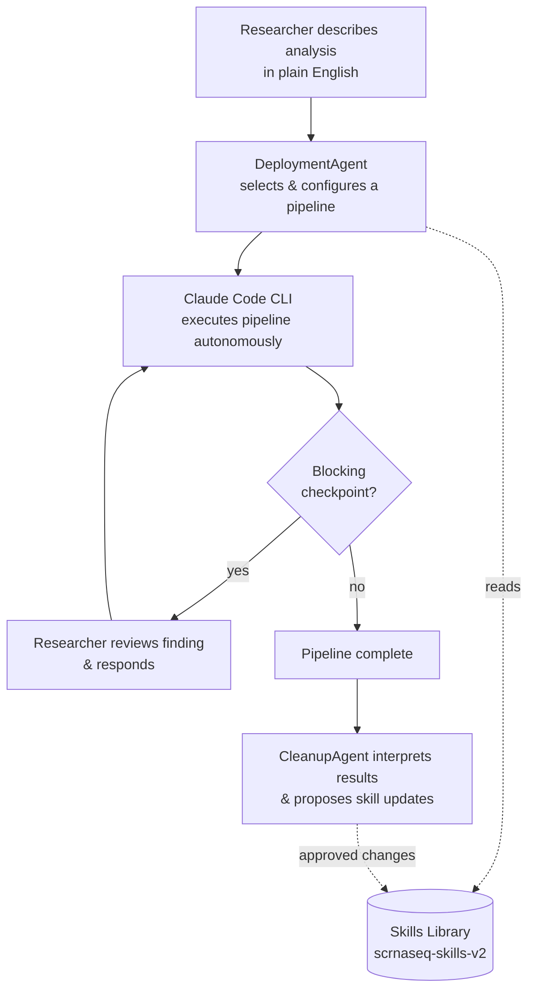
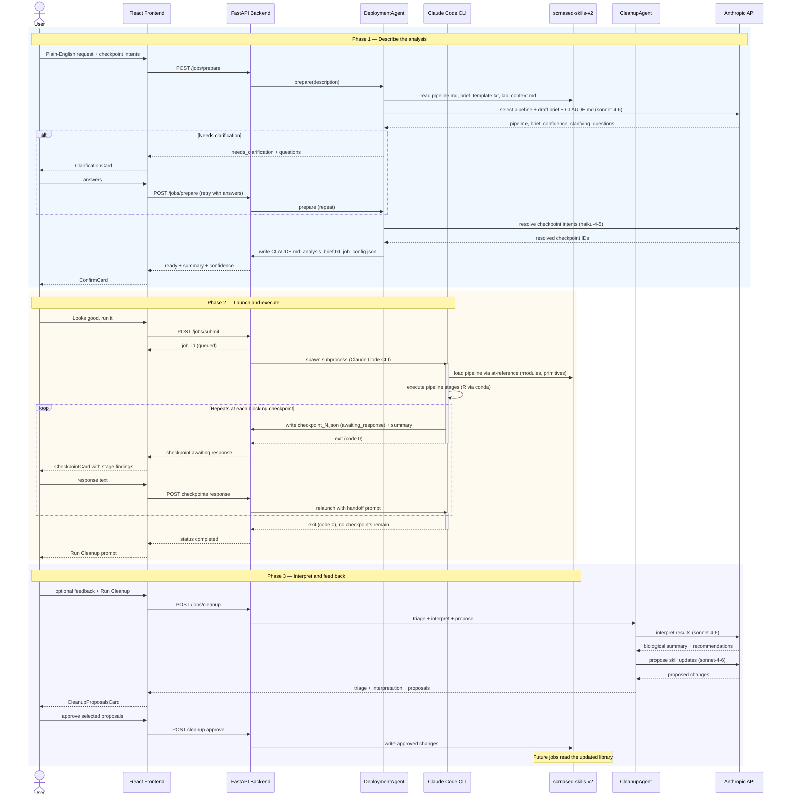

# Lab Analysis Platform

*Orchestration layer for [scrnaseq-skills-v2](https://github.com/Ryannachmand/scrnaseq-skills-v2) — early-stage and actively evolving.*

## Why this exists

Modern single-cell RNA-seq analyses require dozens of computational decisions, extensive scripting, and familiarity with specialized software — a barrier that limits reproducibility and puts sophisticated analysis out of reach for many experimental scientists. This platform narrows that gap by letting a researcher describe an analysis in plain English, while a set of specialized agents handle pipeline selection and execution without sacrificing the structure and reproducibility of expert-designed workflows.

## What this is

This platform is a modular AI workflow architecture built around [scrnaseq-skills-v2](https://github.com/Ryannachmand/scrnaseq-skills-v2) — a curated library of pipeline definitions that this platform selects from, executes, and improves. A `DeploymentAgent` selects and configures the right workflow for each request; execution runs autonomously through Claude Code, pausing at human-reviewed checkpoints rather than proceeding as a single unsupervised prompt; a `CleanupAgent` then interprets the results and proposes improvements back into the shared library. Unlike free-form conversational prompting, every workflow runs through curated, version-controlled pipeline definitions whose execution can be inspected, reproduced, and iteratively improved.

## Architecture at a glance

At a glance, a request flows through pipeline selection, autonomous execution with human checkpoints, and a cleanup step that feeds improvements back into the skills library:



## How It Works

Orion turns a plain-English request into a fully executed, checkpointed analysis pipeline by orchestrating two purpose-built agents around a single Claude Code CLI subprocess. All job state lives as files on disk in `jobs/{id}/` — there's no database.

**1. Pipeline selection.** When you describe an analysis, `DeploymentAgent` reads every available pipeline definition from the companion [scrnaseq-skills-v2](https://github.com/Ryannachmand/scrnaseq-skills-v2) library, picks (or chains) the best match, fills in the analysis parameters, and drafts the actual instruction file the execution agent will follow. If your request is ambiguous, it asks clarifying questions before writing anything to disk.

**2. Autonomous execution.** Once you confirm, the platform launches a Claude Code CLI subprocess inside a dedicated job directory. It reads its generated instructions, loads the relevant pipeline modules from the skills library, and executes the analysis — running R scripts, downloading public data, producing figures — without further API round-trips to keep it moving.

**3. Human-in-the-loop checkpoints.** At key decision points (after clustering, before final annotation), the subprocess pauses by writing a checkpoint file and exiting cleanly — it never blocks or polls itself. The job runner is the only thing waiting: it detects the paused state, surfaces the finding in the UI, and relaunches a fresh Claude Code session with your response once you reply. This repeats until the pipeline completes.

**4. Interpretation and feedback loop.** After completion, `CleanupAgent` triages output files, writes a plain-English summary of what the pipeline found, and — if you leave feedback — proposes specific updates to the shared skills library. Approved proposals are written back into `scrnaseq-skills-v2` directly, so what one job learns becomes available to the next.



## Prerequisites

This app orchestrates analysis pipelines but doesn't ship the pipeline
definitions themselves. Before running it, you need:

- Python 3.11+
- Anaconda (for R pipeline execution via `conda run -n r-env`)
- Docker (optional — for containerised deployment)

1. **Claude Code CLI** — `npm install -g @anthropic-ai/claude-code`, then
   confirm it's on your PATH with `which claude`.

2. **A [scrnaseq-skills-v2](https://github.com/Ryannachmand/scrnaseq-skills-v2) checkout** —
   this is where the actual pipeline templates, briefs, and lab-context files
   live.
   ```bash
   git clone https://github.com/Ryannachmand/scrnaseq-skills-v2.git
   ```
   Follow that repo's own setup instructions to build the `r-env` conda
   environment — this app doesn't create it for you, but the R-based
   pipeline steps require it.

3. **Point this app at it** — set `SKILLS_DIR` in `.env` to the path of your
   `scrnaseq-skills-v2` checkout:
   ```
   SKILLS_DIR=/path/to/scrnaseq-skills-v2
   ```
   This app expects `SKILLS_DIR/pipelines/*/pipeline.md`,
   `SKILLS_DIR/brief_template.txt`, and `SKILLS_DIR/lab_context.md` to exist —
   that's the structure `scrnaseq-skills-v2` provides.

### What happens if you skip this

The API still starts without `SKILLS_DIR` set, but `DeploymentAgent` and
`CleanupAgent` (behind `/jobs/submit`, `/jobs/prepare`, and the cleanup
endpoints) run in degraded mode — low-confidence job results or a stub
`CLAUDE.md` instead of a real one. A startup check logs a warning naming
exactly what's missing rather than failing silently.

## Quickstart

1. Copy the example env file and review settings:
   ```bash
   cp .env.example .env
   ```

2. Start the API:
   ```bash
   bash scripts/start_api.sh
   ```

3. In a second terminal, submit a test job:
   ```bash
   bash scripts/test_submit.sh
   ```

   With `TEST_MODE=true` (the default), jobs complete instantly with a
   mock log — no real Claude Code process is launched.

## Switching from TEST_MODE to real execution

Edit `.env` and set:
```
TEST_MODE=false
```

On the next job submission the API will run the Claude Code CLI
(`CLAUDE_BIN`) inside the job directory with `--dangerously-skip-permissions`.
Ensure Claude Code is authenticated before running real jobs.

## Job directory structure

Each submitted job gets its own directory under `jobs/`:

```
jobs/{job_id}/
├── analysis_brief.txt   ← text submitted as brief_content
├── CLAUDE.md            ← copied from SKILLS_DIR/PROJECT_CLAUDE_TEMPLATE.md
├── job.log              ← stdout/stderr from the Claude Code process
├── status.json          ← machine-readable status + timestamps
└── output/              ← files written here are served via /results
```

## Docker deployment

Build and start with Docker Compose:
```bash
docker compose up --build api
```

The worker service (for containerised R execution) is currently a stub.
To enable it:
1. Export the r-env conda environment: `conda env export -n r-env > worker/r-env.yml`
2. Update `worker/Dockerfile` to install from `r-env.yml`
3. Start with: `docker compose --profile worker up`

## Configuration

Set these in `.env` (see `.env.example`):

| Variable | Default | Purpose |
|----------|---------|---------|
| `JOB_BACKEND` | `local` | Execution backend (`docker`, `slurm`, `lsf` raise `NotImplementedError`) |
| `MAX_CONCURRENT_JOBS` | `2` | Global concurrency limit for simultaneously running jobs |
| `CLAUDE_BIN` | `claude` (resolved via `$PATH`) | Path to the Claude Code CLI binary — run `which claude` to find yours |
| `SKILLS_DIR` | `./claude-skills-v2` | Path to your `scrnaseq-skills-v2` checkout — see Prerequisites |
| `JOBS_DIR` | `./jobs` | Root directory for per-job working directories |
| `API_PORT` | `8000` | FastAPI listen port |
| `ALLOWED_ORIGINS` | `http://localhost:5173` | Comma-separated list of CORS-allowed origins |
| `API_HOST` | `0.0.0.0` | Bind address for the uvicorn server (passed to --host in scripts/start_api.sh) |
| `TEST_MODE` | `true` | When true, the job runner writes a mock completion file instead of launching a real Claude Code subprocess — useful for frontend development without running real pipelines. See .env.example. |

## API Reference

| Method | Path | Description |
|--------|------|-------------|
| `GET` | `/health` | Liveness check; returns `{ status: "ok" }` |
| `POST` | `/jobs/prepare` | Run DeploymentAgent (pipeline selection + file generation) without launching the job; returns `ready` with job files written, or `needs_clarification` with questions (no files written) |
| `POST` | `/jobs/submit` | Run DeploymentAgent then immediately dispatch the job as a background task; returns `{ job_id, status: "queued" }` |
| `POST` | `/jobs` | Legacy submit path: accepts explicit `pipeline` enum + pre-filled `brief_content`; creates job dir and dispatches |
| `GET` | `/jobs` | List all jobs, newest first; returns array of job statuses |
| `GET` | `/jobs/{id}` | Return the status of a single job |
| `GET` | `/jobs/{id}/logs` | Return the full job log (all continuation sessions appended together) |
| `GET` | `/jobs/{id}/results` | Recursive listing of output files: `{ job_id, files: [{ name, size, path }] }` |
| `GET` | `/jobs/{id}/results/{filename:path}` | Download a specific output file (path-traversal protected) |
| `GET` | `/jobs/{id}/checkpoints` | List all checkpoints for a job |
| `POST` | `/jobs/{id}/checkpoints/{cp_id}/response` | Submit a user response to a blocking checkpoint |
| `POST` | `/jobs/{id}/cleanup` | Run CleanupAgent: file triage + result interpretation + (if feedback provided) skills update proposals |
| `GET` | `/jobs/{id}/cleanup/proposals` | Retrieve pending unapproved skill-update proposals |
| `POST` | `/jobs/{id}/cleanup/approve` | Apply approved skill-update proposals to the skills library |

Full request/response schemas are available at the running server's /docs
endpoint (Swagger UI).

## Design Principles

- Reusable pipelines over one-off analysis scripts
- Transparent execution — every stage is inspectable, nothing runs as a black box
- Human oversight preserved at key decision points, not automated away
- The skills library improves with use — validated runs feed back into future runs

## Future work

- Docker worker with full r-env environment
- HPC backends: SLURM and LSF job submission
- Web frontend with job browser and log viewer
- Database layer for job history persistence
